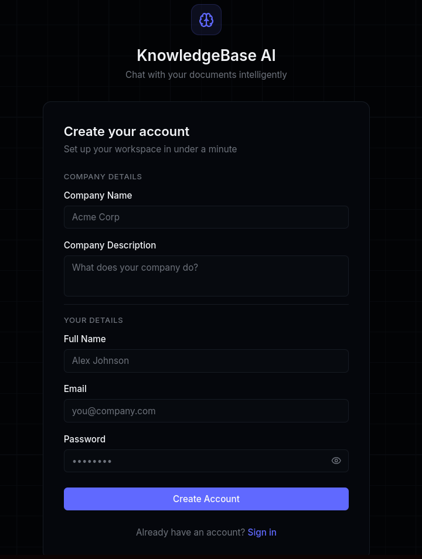
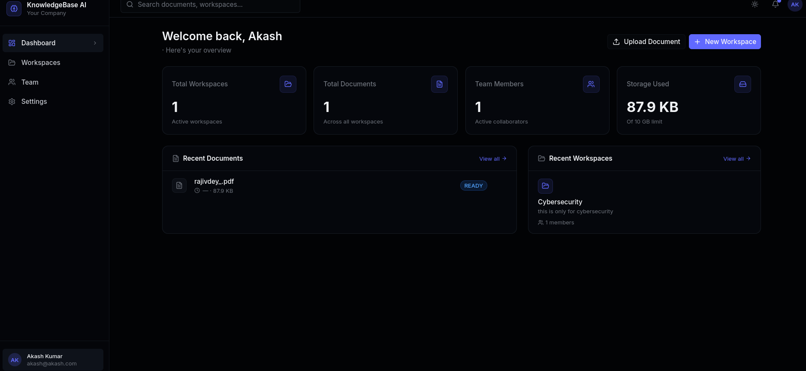
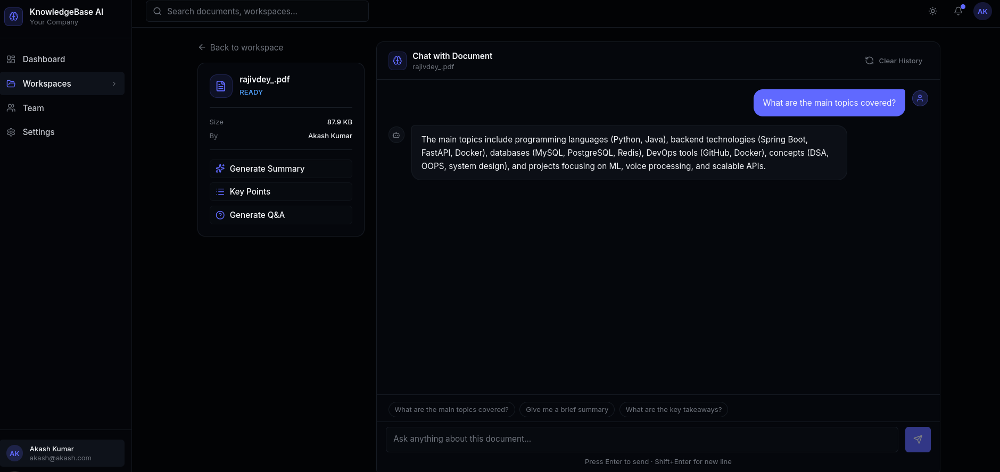
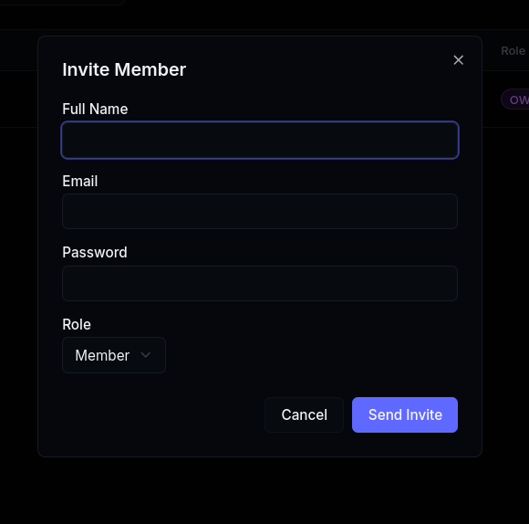
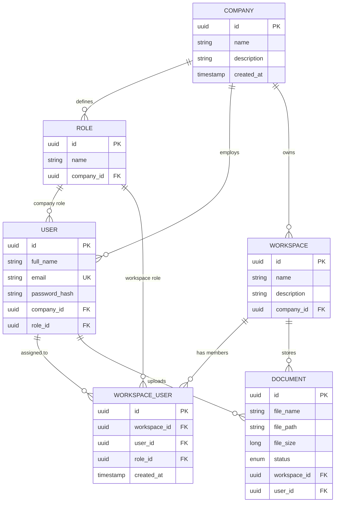

<div align="center">
  <h1>🧠 KnowledgeBase AI</h1>
  <p><strong>Enterprise-grade Multi-Tenant Document Intelligence Platform — Upload documents, chat with AI, and extract insights in real-time</strong></p>

  <p>
    
    
    
    
    
    <br/>
    
    
    
    
    
  </p>

  <p>
    <a href="#-screenshots">View Screenshots</a> •
    <a href="#-getting-started">Quick Start</a> •
    <a href="#-architecture">Architecture</a> •
    <a href="#-api-reference">API Docs</a>
  </p>
</div>

---


## 🎯 Project Overview

**KnowledgeBase AI** is a **production-ready, multi-tenant SaaS platform** built with a microservices architecture that enables organizations to transform their static documents into interactive knowledge bases powered by AI.

### The Problem It Solves

Teams waste hours manually searching through PDFs, reports, and documentation. KnowledgeBase AI lets users **upload any document and have an intelligent conversation** with it — getting instant answers, summaries, and insights without reading hundreds of pages.

### What Makes It Stand Out

| Feature                    | Description                                                                  |
| -------------------------- | ---------------------------------------------------------------------------- |
| 🏢 **Multi-Tenancy**       | Complete data isolation per organization with tenant-scoped database queries |
| 🔒 **RBAC (4-Tier)**       | Granular permissions — Owner → Admin → Member → Viewer                       |
| 🤖 **RAG Pipeline**        | Retrieval-Augmented Generation with LangChain for context-aware AI responses |
| ⚡ **Real-time Streaming** | ChatGPT-like word-by-word response streaming via Server-Sent Events          |
| 💾 **Persistent Chat**     | Chat history saved with deterministic sessions (survives page refreshes)     |
| 🧩 **Microservices**       | Independently deployable Java + Python services with clear API boundaries    |
| 🐳 **One-Command Deploy**  | Full-stack deployment with `docker-compose up`                               |

---

## 📸 Screenshots

<div align="center">

|           Login            |             Dashboard              |
| :------------------------: | :--------------------------------: |
|  |  |

|  AI Chat with Document   |              Team Management              |
| :----------------------: | :---------------------------------------: |
|  |  |

</div>

---

## Demo video

<p align="center">
  <a href="https://drive.google.com/file/d/1mpO5ZLAqs2Kk1X_PVVoyYolsJrJCsRlT/view?usp=sharing">
    
  </a>
</p>

## 🏗️ Architecture

The platform follows a **microservices architecture** with three independently deployed services communicating over REST APIs:

```text
┌─────────────────────────────────────────────────────────────────┐
│                     Next.js 14 Frontend (:3000)                 │
│           TypeScript • Tailwind CSS • shadcn/ui • Zustand       │
└──────────────────┬──────────────────────────┬───────────────────┘
                   │ REST + JWT               │ REST + SSE
                   ▼                          ▼
┌─────────────────────────┐    ┌──────────────────────────────┐
│   Spring Boot API (:8080)│    │     FastAPI AI Service (:8000) │
│                         │    │                              │
│  • JWT Authentication   │    │  • Document Processing (PDF) │
│  • Multi-tenant RBAC    │───▶│  • Semantic Chunking Engine  │
│  • Organization Mgmt    │    │  • Vector Embeddings (OpenAI)│
│  • Workspace CRUD       │    │  • RAG Chat Pipeline         │
│  • Document Metadata    │    │  • Streaming SSE Responses   │
│  • Member Management    │    │  • Chat History (Redis)      │
└──────────┬──────────────┘    └─────┬───────────┬────────────┘
           │                         │           │
     ┌─────▼──────┐          ┌───────▼───┐  ┌───▼──────────┐
     │ PostgreSQL  │          │  Qdrant   │  │    Redis     │
     │   (NeonDB)  │          │ Vector DB │  │  Chat Memory │
     │             │          │           │  │  + Sessions  │
     │ • Users     │          │ • Chunks  │  │              │
     │ • Companies │          │ • Vectors │  │ • 7-day TTL  │
     │ • Workspaces│          │ • Indexes │  │ • Per-user   │
     │ • Documents │          │           │  │   per-doc    │
     └─────────────┘          └───────────┘  └──────────────┘
```

### Inter-Service Communication

```text
Frontend ──[JWT Token]──▶ Spring Boot ──[Internal REST]──▶ FastAPI
                              │                               │
                              │ document metadata             │ document processing
                              ▼                               ▼
                          PostgreSQL                    Qdrant + Redis
```

1. **Frontend** authenticates via Spring Boot → receives JWT
2. **Spring Boot** handles all business logic, RBAC, and stores metadata in PostgreSQL
3. **FastAPI** handles AI workloads — document parsing, embedding, vector search, and chat
4. **Spring Boot** calls FastAPI internally when documents are uploaded for processing

---

## 🔐 Role-Based Access Control (RBAC)

KnowledgeBase AI implements a **4-tier hierarchical permission system** with both company-level and workspace-level access controls:

| Permission                  | Owner | Admin | Member | Viewer |
| :-------------------------- | :---: | :---: | :----: | :----: |
| Create/Delete Workspaces    |  ✅   |  ✅   |   ❌   |   ❌   |
| Invite Users to Company     |  ✅   |  ✅   |   ❌   |   ❌   |
| View All Company Workspaces |  ✅   |  ✅   |   ❌   |   ❌   |
| Upload Documents            |  ✅   |  ✅   |   ✅   |   ❌   |
| Chat with Documents         |  ✅   |  ✅   |   ✅   |   ✅   |
| Add Members to Workspace    |  ✅   |  ✅   |   ❌   |   ❌   |
| Delete Documents            |  ✅   |  ✅   |   ❌   |   ❌   |
| Access Settings             |  ✅   |  ✅   |   ❌   |   ❌   |

**Workspace-Level Access:** Members and Viewers can only see workspaces they are explicitly invited to. Owner/Admin can see all company workspaces.

---

## 🤖 RAG Pipeline — How AI Chat Works

The AI chat feature uses **Retrieval-Augmented Generation (RAG)** — a technique that grounds LLM responses in your actual document content, preventing hallucinations:

```text
Step 1: DOCUMENT UPLOAD
    PDF → PyPDF2 Parser → Raw Text

Step 2: INTELLIGENT CHUNKING
    Raw Text → 500-char chunks (50-char overlap) → Preserves context

Step 3: VECTOR EMBEDDING
    Chunks → OpenAI Embedding Model → 1536-dim vectors

Step 4: VECTOR STORAGE
    Vectors + Metadata → Qdrant Cloud (Cosine Similarity Index)

Step 5: USER ASKS A QUESTION
    Query → Embedding → Top-K Similarity Search → Relevant Chunks

Step 6: AI GENERATION
    Relevant Chunks + Query → LangChain Prompt → LLM → Streamed Response
```

### AI Features

- **💬 Contextual Chat:** Ask questions and get answers grounded in your documents
- **📝 Auto-Summarization:** Generate concise summaries of entire documents
- **🔑 Key Points Extraction:** Pull out the most important takeaways automatically
- **❓ Smart Q&A Generation:** Auto-generate potential interview/exam questions from content
- **⚡ Streaming Responses:** Real-time word-by-word generation via Server-Sent Events
- **💾 Persistent History:** Chat conversations are saved per-user per-document (7-day TTL)

---

## 🛠️ Technology Stack

### Backend — Spring Boot (Java)

| Component | Technology                                             |
| --------- | ------------------------------------------------------ |
| Framework | Spring Boot 3.x, Java 17                               |
| Security  | Spring Security + JWT (HMAC-SHA256)                    |
| Database  | PostgreSQL (NeonDB) via Spring Data JPA + Hibernate    |
| ORM       | JPA with entity relationships, `@ManyToOne`, cascading |
| Build     | Maven Wrapper (`mvnw`)                                 |
| Utilities | Lombok, RestClient for inter-service calls             |

### AI Service — FastAPI (Python)

| Component           | Technology                                      |
| ------------------- | ----------------------------------------------- |
| Framework           | FastAPI (async), Uvicorn                        |
| AI/LLM              | LangChain, OpenRouter API (access to 100+ LLMs) |
| Vector DB           | Qdrant Cloud (semantic similarity search)       |
| Cache               | Redis (chat history, session memory)            |
| Document Processing | PyPDF2 (PDF parsing)                            |
| Real-time           | Server-Sent Events (SSE) for streaming          |

### Frontend — Next.js

| Component  | Technology                                                |
| ---------- | --------------------------------------------------------- |
| Framework  | Next.js 14 (App Router), TypeScript                       |
| UI Library | shadcn/ui component system                                |
| Styling    | Tailwind CSS, dark mode                                   |
| State      | Zustand (global), React hooks (local)                     |
| UX         | Streaming chat, drag-and-drop upload, toast notifications |

### Infrastructure

| Component        | Technology                        |
| ---------------- | --------------------------------- |
| Containerization | Docker + Docker Compose           |
| Database         | PostgreSQL 15 (Alpine)            |
| Vector Store     | Qdrant (latest)                   |
| Cache            | Redis 7 (Alpine)                  |
| Cloud Options    | NeonDB, Qdrant Cloud, Redis Cloud |

---

## 🚀 Getting Started

### Option 1: Docker Compose (Recommended)

The fastest way to get everything running:

```bash
# Clone the repository
git clone https://github.com/yourusername/knowledge-base-ai.git
cd knowledge-base-ai

# Configure your API keys
cp fastapi-ai-services/.env.example fastapi-ai-services/.env
# Edit .env with your OPENROUTER_API_KEY

# Launch all services
docker-compose up --build
```

Once running:

| Service            | URL                             |
| ------------------ | ------------------------------- |
| Frontend           | http://localhost:3000           |
| Spring Boot API    | http://localhost:8080           |
| FastAPI AI Service | http://localhost:8000           |
| Qdrant Dashboard   | http://localhost:6333/dashboard |

### Option 2: Manual Setup

<details>
<summary><strong>Click to expand step-by-step instructions</strong></summary>

#### Prerequisites

- Java 17+, Python 3.10+, Node.js 18+
- PostgreSQL Server or NeonDB account
- Qdrant Cloud cluster or local instance
- Redis server or Redis Cloud account
- OpenRouter API key (for LLM access)

#### 1. Spring Boot Backend

```bash
cd CoreBackend-SpringBoot
```

Configure `src/main/resources/application.properties`:

```properties
spring.datasource.url=jdbc:postgresql://your-host/your-db?sslmode=require
spring.datasource.username=your_username
spring.datasource.password=your_password
spring.jpa.hibernate.ddl-auto=update
app.jwt.secret=your-256-bit-secret-key-minimum-32-characters
app.jwt.expiry=86400000
fastapi.url=http://localhost:8000
file.upload.dir=uploads/
```

```bash
./mvnw spring-boot:run
```

#### 2. FastAPI AI Service

```bash
cd fastapi-ai-services
pip install -r requirements.txt
```

Configure `.env`:

```env
OPENROUTER_API_KEY=your-openrouter-key
OPENROUTER_BASE_URL=https://openrouter.ai/api/v1
LLM_MODEL=mistralai/mistral-7b-instruct
QDRANT_URL=your-qdrant-url
QDRANT_API_KEY=your-qdrant-api-key
QDRANT_COLLECTION=documents
REDIS_URL=redis://:password@host:port
```

```bash
uvicorn app.main:app --reload --port 8000
```

#### 3. Frontend

```bash
cd frontend
npm install
```

Configure `.env.local`:

```env
NEXT_PUBLIC_SPRING_URL=http://localhost:8080
NEXT_PUBLIC_FASTAPI_URL=http://localhost:8000
```

```bash
npm run dev
```

</details>

### First Steps After Setup

1. **Register** → Creates your organization + your Owner account
2. **Create a Workspace** → e.g., "Product Research"
3. **Upload a PDF** → Drag & drop or click to browse
4. **Chat with it** → Click "Chat" on any document to start asking questions
5. **Invite your team** → Go to Team page → Invite Member → They log in and get access

---

## 🧬 Database Schema

### Entity Relationship Model



---

## 📡 API Reference

<details>
<summary><strong>🔵 Spring Boot APIs (Port 8080)</strong></summary>

### Authentication

| Method | Endpoint             | Description                           | Auth        |
| ------ | -------------------- | ------------------------------------- | ----------- |
| `POST` | `/api/auth/register` | Register organization + owner account | Public      |
| `POST` | `/api/auth/login`    | Login → returns JWT token             | Public      |
| `POST` | `/api/auth/invite`   | Invite member to organization         | Owner/Admin |

### Users

| Method | Endpoint        | Description                    | Auth |
| ------ | --------------- | ------------------------------ | ---- |
| `GET`  | `/api/users/me` | Get current authenticated user | JWT  |
| `GET`  | `/api/users`    | List all company users         | JWT  |

### Workspaces

| Method   | Endpoint               | Description                | Auth         |
| -------- | ---------------------- | -------------------------- | ------------ |
| `GET`    | `/api/workspaces`      | List accessible workspaces | JWT          |
| `POST`   | `/api/workspaces`      | Create new workspace       | Owner/Admin  |
| `GET`    | `/api/workspaces/{id}` | Get workspace details      | JWT (scoped) |
| `PUT`    | `/api/workspaces/{id}` | Update workspace           | Owner/Admin  |
| `DELETE` | `/api/workspaces/{id}` | Delete workspace           | Owner/Admin  |

### Workspace Members

| Method   | Endpoint                                | Description             | Auth         |
| -------- | --------------------------------------- | ----------------------- | ------------ |
| `GET`    | `/api/workspaces/{id}/members`          | List workspace members  | JWT (scoped) |
| `POST`   | `/api/workspaces/{id}/members`          | Add member to workspace | Owner/Admin  |
| `DELETE` | `/api/workspaces/{id}/members/{userId}` | Remove member           | Owner/Admin  |

### Documents

| Method   | Endpoint                        | Description                 | Auth        |
| -------- | ------------------------------- | --------------------------- | ----------- |
| `POST`   | `/api/documents`                | Upload document (multipart) | JWT         |
| `GET`    | `/api/documents/workspace/{id}` | List workspace documents    | JWT         |
| `GET`    | `/api/documents/{id}`           | Get document details        | JWT         |
| `DELETE` | `/api/documents/{id}`           | Delete document             | Owner/Admin |

</details>

<details>
<summary><strong>🟢 FastAPI AI Service (Port 8000)</strong></summary>

### Document Processing

| Method   | Endpoint                  | Description                          |
| -------- | ------------------------- | ------------------------------------ |
| `POST`   | `/documents/process/{id}` | Parse, chunk, embed & store document |
| `DELETE` | `/documents/{id}`         | Remove document vectors from Qdrant  |

### AI Chat

| Method | Endpoint           | Description                        |
| ------ | ------------------ | ---------------------------------- |
| `POST` | `/chat/`           | Chat with document (synchronous)   |
| `POST` | `/chat/stream`     | Chat with document (streaming SSE) |
| `POST` | `/chat/summary`    | Generate AI document summary       |
| `POST` | `/chat/key-points` | Extract key points from document   |
| `POST` | `/chat/questions`  | Generate Q&A from document content |

### Chat History

| Method   | Endpoint                     | Description           |
| -------- | ---------------------------- | --------------------- |
| `GET`    | `/chat/history/{session_id}` | Retrieve chat history |
| `DELETE` | `/chat/history/{session_id}` | Clear chat session    |

</details>

---

## 📂 Project Structure

```
KnowledgeBase-AI/
├── CoreBackend-SpringBoot/          # Java Spring Boot microservice
│   ├── src/main/java/.../
│   │   ├── controller/              # REST API controllers
│   │   ├── service/                 # Business logic layer
│   │   ├── entity/                  # JPA entities (User, Workspace, Document...)
│   │   ├── repository/              # Spring Data JPA repositories
│   │   ├── dto/                     # Request/Response DTOs
│   │   ├── security/                # JWT filter, auth config
│   │   ├── mapper/                  # Entity ↔ DTO mappers
│   │   └── util/                    # Security utilities, helpers
│   └── pom.xml
│
├── fastapi-ai-services/             # Python FastAPI microservice
│   ├── app/
│   │   ├── routers/                 # API route handlers
│   │   ├── services/                # Business logic (chat, document processing)
│   │   ├── models/                  # Pydantic schemas
│   │   └── main.py                  # FastAPI app entry point
│   └── requirements.txt
│
├── frontend/                        # Next.js 14 frontend
│   ├── app/                         # App Router pages
│   │   ├── dashboard/               # Authenticated dashboard views
│   │   ├── login/                   # Auth pages
│   │   └── register/
│   ├── components/                  # Reusable UI components
│   ├── lib/                         # API client, store, utilities
│   └── package.json
│
├── docker-compose.yml               # Full-stack orchestration
├── images/                          # Documentation screenshots
└── README.md
```

---

## 🧪 Design Decisions & Trade-offs

| Decision                      | Why                                                                                                      |
| ----------------------------- | -------------------------------------------------------------------------------------------------------- |
| **Two-service backend**       | Java for enterprise RBAC/auth + Python for AI/ML workloads — each language plays to its strength         |
| **Qdrant over Pinecone**      | Self-hostable, open-source, and supports filtering by document ID for multi-tenant isolation             |
| **Redis for chat history**    | Sub-millisecond reads, TTL-based auto-cleanup (7 days), no schema overhead                               |
| **Deterministic session IDs** | `session-{docId}-{userId}` ensures chat history persists across page refreshes                           |
| **SSE over WebSockets**       | Simpler for unidirectional streaming (AI responses), no connection state management needed               |
| **Company-scoped roles**      | Roles are per-company, allowing different organizations to have identically named roles without conflict |

---

## 🔮 Planned Enhancements

- [ ] **Multi-document cross-chat** — Query across multiple documents in a single conversation
- [ ] **Document versioning** — Track and compare document revisions
- [ ] **Audit logging** — Track all user actions for compliance
- [ ] **OAuth2 / SSO** — Google, GitHub login integration
- [ ] **Export conversations** — Download chat as PDF/Markdown
- [ ] **Kubernetes deployment** — Helm charts for production orchestration

---

<div align="center">
  <h3>Built with ❤️ as a full-stack microservices initiative</h3>
  <p>
    <strong>Spring Boot</strong> • <strong>FastAPI</strong> • <strong>Next.js</strong> • <strong>LangChain</strong> • <strong>Qdrant</strong> • <strong>Redis</strong> • <strong>Docker</strong>
  </p>
  <p>
    <sub>Designed and developed to demonstrate enterprise-grade software engineering — from system architecture and database design to AI integration and production deployment.</sub>
  </p>
</div>
