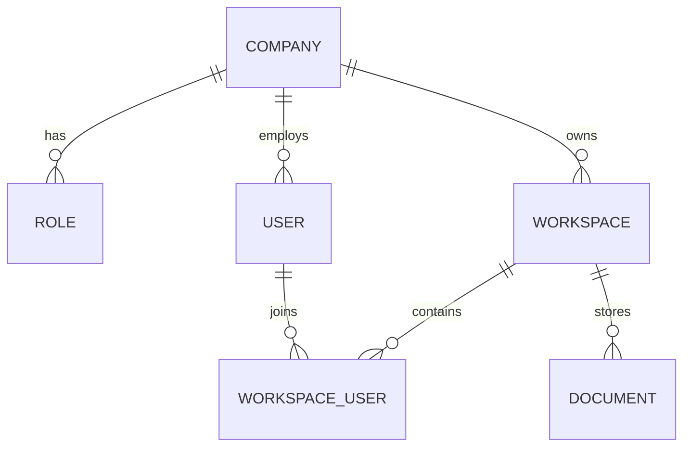

<div align="center">
  <h1>🧠 KnowledgeBase AI</h1>
  <p><strong>A production-grade microservices-based multi-tenant SaaS platform that lets teams upload documents and chat with them using AI.</strong></p>

  <!-- Badges -->
  <p>
    
    
    
    
    
    <br/>
    
    
    
    
  </p>
</div>

---

## 📌 What is this?

**KnowledgeBase AI** is a highly scalable, **multi-tenant document intelligence platform** designed for modern teams. Companies can:
- **🏢 Register Organizations:** Create dynamic workspaces and invite team members.
- **📁 Organize Documents:** Securely upload PDFs/text files into dedicated workspaces.
- **🤖 Chat with Data:** Use Advanced Contextual AI (RAG) to chat with documents.
- **⚡ Get Instant Insights:** Leverage automatic summaries, key points extraction, and intelligent Q&A generation.
- **🛡️ Secure Access:** Control data visibility with strict role-based access control (Owner, Admin, Member, Viewer).

---

## 🏗️ Architecture Design

Our platform leverages a **Microservices Architecture** to ensure independent scalability and fault tolerance.

```text
┌─────────────────────────────────────────────────────────────┐
│                        Next.js Frontend                      │
│                    (TypeScript + Tailwind)                   │
└──────────────────┬──────────────────────┬───────────────────┘
                   │                      │
          REST API │                      │ REST API
                   ▼                      ▼
┌──────────────────────┐    ┌─────────────────────────┐
│   Spring Boot API    │    │      FastAPI Service     │
│   (Port 8080)        │    │      (Port 8000)         │
│                      │    │                          │
│  • Auth & Security   │    │  • Document Parsing      │
│  • User Management   │    │  • Intelligent Chunking  │
│  • Organization Logic│    │  • OpenAI Embeddings     │
│  • Document Metadata │───▶│  • Semantic Vector Search│
│  • RBAC & Permissions│    │  • Streaming AI Chat     │
└──────────┬───────────┘    └────────────┬────────────┘
           │                             │
     ┌─────┴──────┐              ┌───────┴──────┐
     │ PostgreSQL  │              │    Qdrant    │
     │  (NeonDB)   │              │  Vector DB   │
     └─────────────┘              └──────┬───────┘
                                         │
                                  ┌──────┴──────┐
                                  │    Redis    │
                                  │   (Cloud)   │
                                  └─────────────┘
```

---

## ✨ Key Features & Capabilities

### 🔐 Multi-tenancy & Security
- **JWT-based Authentication** with secure token validation.
- **Data Isolation:** Every company gets strictly isolated data via tenant IDs.
- **Role-based Access Control (RBAC):** Hierarchical permissions (Owner → Admin → Member → Viewer).

### 🤖 Advanced AI Document Chat (RAG Pipeline)
- **Chat Contextually:** Ask anything and get hyper-relevant, context-aware answers.
- **Streaming Responses:** Real-time word-by-word generation for a smooth ChatGPT-like UX.
- **Auto-Summarization:** Instantly digest large documents with accurate AI summaries.
- **Multi-document Analysis:** Interrogate multiple documents simultaneously in a single chat.
- **Smart Q&A Generation:** Automatically generates potential test/interview questions based on the document text.

---

## 🛠️ Technology Stack Overview

**Backend — Spring Boot Service**
- **Core:** Java 17, Spring Boot 3.x
- **Security:** Spring Security + JWT
- **Data:** PostgreSQL ( NeonDB ) via Spring Data JPA + Hibernate
- **Utilities:** Lombok, RestClient

**AI Service — FastAPI**
- **Core:** Python 3.10+, FastAPI (Async)
- **AI & RAG:** LangChain, OpenRouter API (Access to 100+ LLMs)
- **Data Stores:** Qdrant (Vector DB), Redis Cloud (Session & Memory)
- **Document Processing:** PyPDF2
- **Real-time:** Server-Sent Events (SSE) for streaming

**Frontend — Next.js**
- **Core:** Next.js 14 (App Router), TypeScript
- **Styling:** Tailwind CSS, shadcn/ui components
- **State Management:** Zustand, TanStack Query

---

## 🚀 Getting Started Guide

<details>
<summary><strong>Click to expand prerequisites and setup instructions</strong></summary>

### Prerequisites
- Java 17+, Python 3.10+, Node.js 18+
- PostgreSQL Server / NeonDB Account
- Qdrant Cloud Cluster
- Redis Cloud Account
- OpenRouter API Key

### 1. Spring Boot Setup
```bash
cd CoreBackend-SpringBoot
```
Configure `src/main/resources/application.properties`:
```properties
spring.datasource.url=jdbc:postgresql://your-neon-host/neondb?sslmode=require
spring.datasource.username=your_username
spring.datasource.password=your_password
spring.jpa.hibernate.ddl-auto=update
app.jwt.secret=your-256-bit-secret-key-minimum-32-characters
app.jwt.expiry=86400000
fastapi.url=http://localhost:8000
file.upload.dir=uploads/
```
Run the application:
```bash
./mvnw spring-boot:run
```

### 2. FastAPI Setup
```bash
cd fastapi-ai-services
pip install -r requirements.txt
```
Configure `.env`:
```env
OPENROUTER_API_KEY=your-openrouter-key
OPENROUTER_BASE_URL=https://openrouter.ai/api/v1
LLM_MODEL=mistralai/mistral-7b-instruct
QDRANT_URL=your-qdrant-cloud-url
QDRANT_API_KEY=your-qdrant-api-key
QDRANT_COLLECTION=documents
REDIS_URL=redis://:password@host:port
```
Run the service:
```bash
uvicorn app.main:app --reload --port 8000
```

### 3. Frontend Setup
```bash
cd frontend
npm install
```
Configure `.env.local`:
```env
NEXT_PUBLIC_SPRING_URL=http://localhost:8080
NEXT_PUBLIC_FASTAPI_URL=http://localhost:8000
```
Run the development server:
```bash
npm run dev
```
</details>

---

## 🧬 Data Flow & Database Schema

### Entity Relationship Model


### RAG Data Pipeline
1. **Document Upload:** PDF parsed via PyPDF2.
2. **Chunking Engine:** Text divided into 500-character chunks with 50-character overlaps.
3. **Embeddings:** Vectorized using OpenRouter APIs.
4. **Vector Storage:** Embeddings pushed to Qdrant Cloud.
5. **Retrieval Search:** User queries fetch top-K chunks via Cosine Similarity.
6. **LLM Generation:** Relevant chunks injected into LangChain prompts to stream intelligent responses.

---

## 📡 API Endpoints Reference

<details>
<summary><strong>Spring Boot APIs (Port 8080)</strong></summary>

| Method | Endpoint | Description | Auth |
|---|---|---|---|
| `POST` | `/api/auth/register` | Register company + owner | Public |
| `POST` | `/api/auth/login` | Login | Public |
| `POST` | `/api/auth/invite` | Invite team member | Owner |
| `GET` | `/api/users/me` | Get current user | Valid JWT |
| `GET` | `/api/companies/{id}` | Get company details | Valid JWT |
| `POST` | `/api/workspaces` | Create workspace | Owner/Admin |
| `POST` | `/api/documents` | Upload document | Valid JWT |
| `GET` | `/api/documents/workspace/{id}` | List documents | Valid JWT |

</details>

<details>
<summary><strong>FastAPI Services (Port 8000)</strong></summary>

| Method | Endpoint | Description |
|---|---|---|
| `POST` | `/documents/process/{id}` | Process & embed document |
| `POST` | `/chat/` | Chat with document (synchronous) |
| `POST` | `/chat/stream` | Chat with document (streaming SSE) |
| `POST` | `/chat/summary` | Generate document summary |
| `POST` | `/chat/key-points` | Extract key points |
| `DELETE`| `/chat/history/{sessionId}` | Clear session memory |

</details>

---

<div align="center">
  <p><strong>Built with ❤️ as a full-stack microservices initiative.</strong></p>
  <p>Spring Boot • FastAPI • Next.js • LangChain • Qdrant • Redis</p>
  <p>MIT License</p>
</div>
